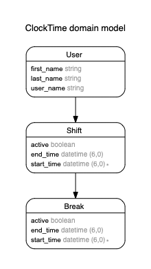

# README

This README would normally document whatever steps are necessary to get the
application up and running.

## System dependencies: Ruby on Rails
- Install Ruby
    * Ruby version: 2.7.5
- Install rails `gem install rails`
    * Rails version >= 7

## Database creation
   `bundle exec rake db:migrate`

## Running Test
   `bundle exec rspec`

## Running the server
  `bundle exec rails s`

### ERD

